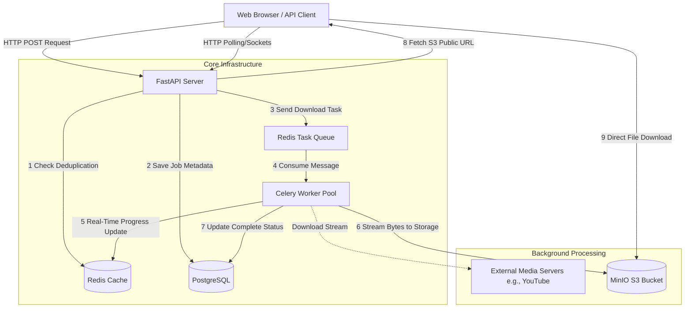

# 🚀 Scalable Media Download Service

An asynchronous, horizontally scalable media download platform (wrapping tools like `yt-dlp`). Designed to process heavy workloads smoothly using distributed background workers, caching, and independent object storage.

---

## 🏗 High-Level Architecture

The system utilizes an asynchronous event-driven architecture that completely decouples the user-facing web API from the long-running video downloading process.


### ⚙️ System Components
1. **Frontend / API Layer:** Built on **FastAPI (Python Async)**. Handles extremely high concurrency, performs rate limiting, authenticates users, and manages deduplication (to prevent downloading the same video multiple times).
2. **Message Broker / Cache:** Powered by **Redis**. Acts as the Celery Queue broker, stores real-time progress percentages, and holds the API rate-limit sliding windows.
3. **Primary Database:** Powered by **PostgreSQL**. The source of truth for job persistence, configurations, and metadata.
4. **Worker Fleet:** Powered by **Celery**. Computes the heavy-lifting logic (`yt-dlp` parsing and downloads) decoupled from the API. The pool can be scaled horizontally across multiple nodes.
5. **Storage Layer:** Powered by **MinIO/AWS S3**. Files bypass the Application Server entirely when being downloaded by the end user via directly generated public object links.

---

## 🛠️ Features
- **Idempotency & Deduplication:** Hashing ensures duplicate URL+format requests are instantly served from cache to save bandwidth.
- **Failover & Retries:** Celery `acks_late=True` and strict retry limits ensure crash resilience and graceful networking failure recovery.
- **Micro-batching / Monitoring:** Complete tracking through custom Flower dashboards and real-time frontend socket emulation.
- **Fully Dockerized:** Spin up the entire multi-tier stack with a single Compose command.

---

## 🏎️ Getting Started

### 1. Prerequisites
Ensure you have Docker and Docker Compose installed. You do not need Python or PostgreSQL installed natively on your machine!

### 2. Configuration
Copy the sample environment variables:
```bash
cp .env.example .env
```
*(Optionally tweak `S3_PUBLIC_URL` to your machine's exact LAN IP if you wish to download from mobile devices on the same Wi-Fi).*

### 3. Start the Stack
Spin up the entire architecture (PostgreSQL, Redis, MinIO, FastAPI, Celery Workers, Flower UI):
```bash
docker-compose up -d --build
```

### 4. Dashboards & Routes
Once the containers are running, you can access the completely disparate operational layers via:
- **Main Download UI:** [http://localhost:8000](http://localhost:8000)
- **API Swagger Docs:** [http://localhost:8000/docs](http://localhost:8000/docs)
- **MinIO Cloud Storage:** [http://localhost:9001](http://localhost:9001) *(S3 Bucket Visualizer)*
- **Flower Dashoard:** [http://localhost:5555](http://localhost:5555) *(Live Celery Worker visualizer)*

---

## 📡 Deployment in Production
For production deployment, you can safely swap out the internal containers for managed services:
*   Swap `Redis` container -> AWS ElastiCache
*   Swap `PostgreSQL` container -> AWS RDS
*   Swap `MinIO` container -> AWS S3 standard buckets
Because the architecture expects explicit string endpoints, this requires exactly zero code changes.
