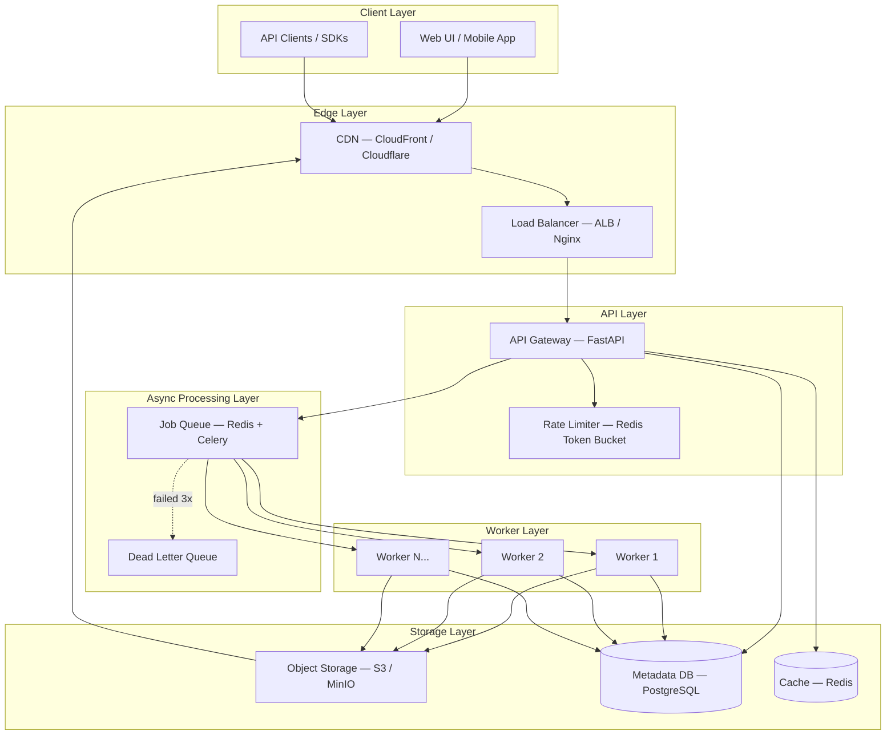
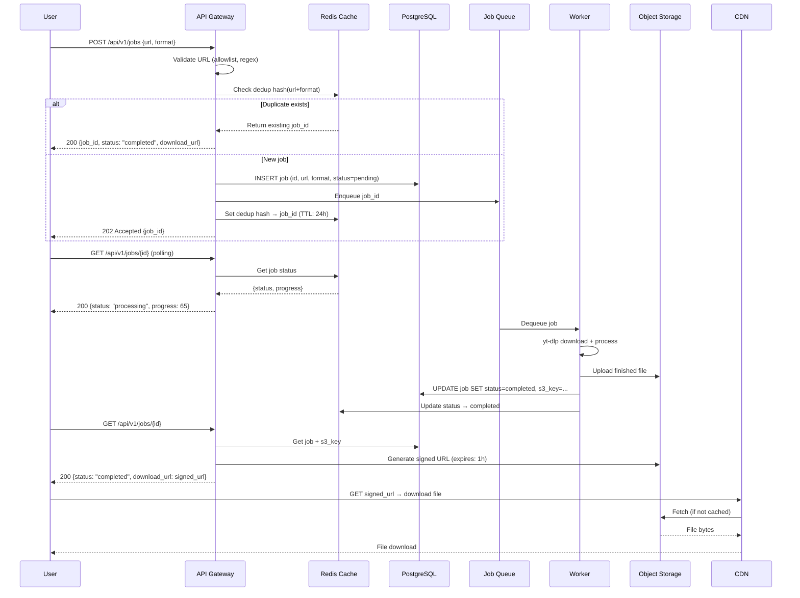
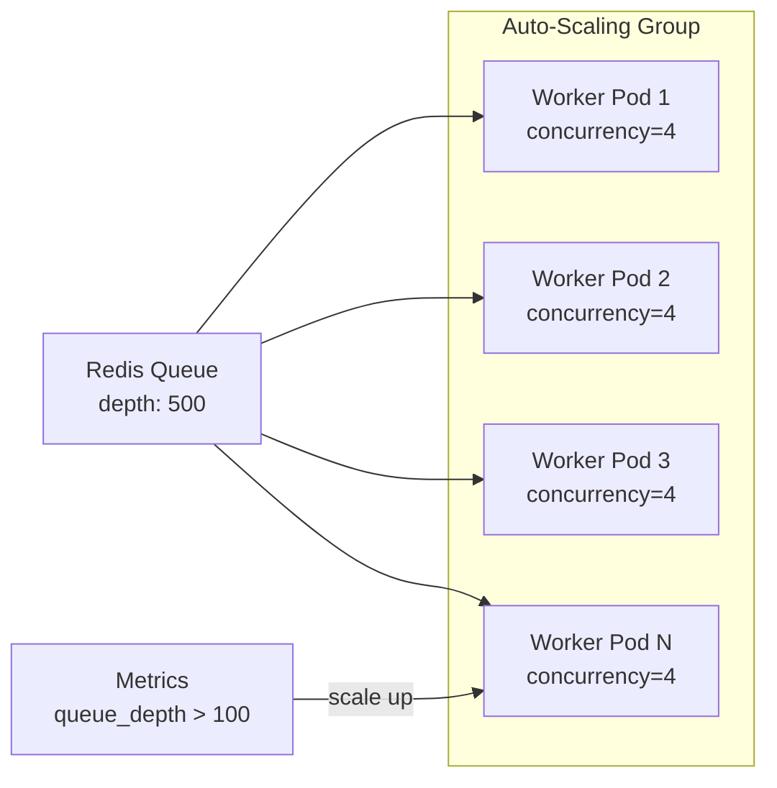
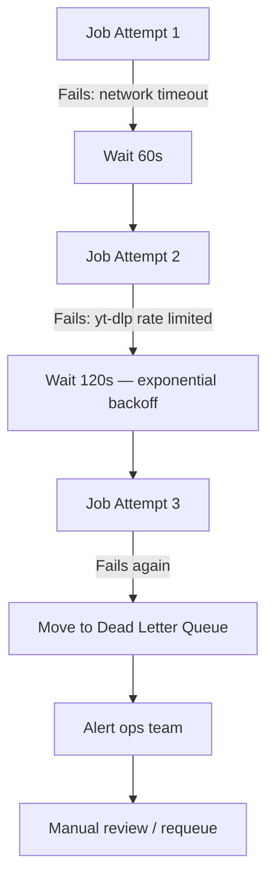
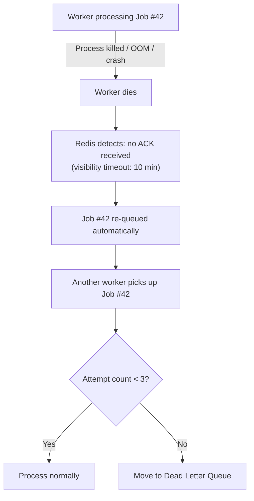
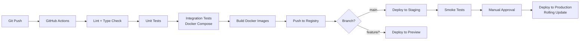

# Media Download Service — Scalable Architecture Plan

## Current System Analysis

Your existing system ([app.py](file:///Users/farhan/Desktop/priv/test/app.py)) is a single-process Flask app that:

1. Accepts a URL + quality mode via `POST /download`
2. **Synchronously** invokes `yt-dlp` to download the media
3. Streams the finished file back in the **same HTTP response**
4. Deletes the local file after the response completes

This is clean and functional for a single user, but has fundamental limits:

| Problem | Impact |
|---|---|
| **Blocking I/O** — the Flask worker is occupied for the entire download (30s–10min) | A handful of concurrent users exhaust all WSGI workers |
| **HTTP timeout** — long downloads exceed reverse-proxy / browser timeouts | Users see failed requests for large files |
| **No job tracking** — the client has no way to check progress or retry | Broken user experience on any failure |
| **Local disk** — files live on the server filesystem temporarily | Single-server limit, no CDN, no persistence |
| **No deduplication** — two users requesting the same video trigger two downloads | Wasted bandwidth and CPU |
| **No retry / fault tolerance** — if the process crashes mid-download, the job is lost | Silent data loss |

---

## 1. High-Level Architecture (HLD)



### Component Responsibilities

| Component | Technology | Why This Choice |
|---|---|---|
| **API Gateway** | FastAPI (Python) | Async-native, auto OpenAPI docs, Pydantic validation, keeps Python ecosystem consistency |
| **Job Queue** | Redis + Celery | Battle-tested, simple setup, Redis doubles as cache; Kafka is overkill until >50k jobs/min |
| **Workers** | Celery Workers (stateless) | Auto-scaling, pluggable concurrency (prefork/gevent), built-in retry |
| **Object Storage** | S3 (prod) / MinIO (dev) | Infinite scale, signed URLs, lifecycle policies, CDN-friendly |
| **Metadata DB** | PostgreSQL | ACID compliance, JSONB for flexible metadata, mature ecosystem |
| **Cache** | Redis | Already deployed for Celery broker, sub-ms reads for dedup + status lookups |
| **Load Balancer** | Nginx / ALB | SSL termination, health checks, sticky sessions not needed (stateless API) |
| **CDN** | CloudFront / Cloudflare | Edge caching of downloaded files, reduces egress costs |

> [!IMPORTANT]
> **Why FastAPI over Flask?** Flask's WSGI model spawns a thread/process per request. FastAPI's ASGI model handles thousands of concurrent connections on a single process. Since the API layer only enqueues jobs and reads status (all I/O-bound), async is a massive efficiency win. The heavy lifting (yt-dlp) runs in separate Celery workers.

> [!NOTE]
> **Why Redis+Celery over Kafka/SQS?** At this scale, Celery with Redis broker handles ~10k–50k jobs/minute with minimal infrastructure. Kafka adds operational complexity (ZooKeeper, partition management) that's only justified at >100k jobs/min or when you need event replay. SQS is a strong alternative if you're AWS-native.

---

## 2. Detailed Request Flow



### Step-by-Step Walkthrough

| Step | What Happens | Latency |
|---|---|---|
| **1. Submit** | User POSTs a URL. API validates it, checks dedup cache, creates a job row, enqueues to Redis. Returns immediately. | **~50ms** |
| **2. Dedup Check** | SHA-256 of `(normalized_url + format)` looked up in Redis. If found and not expired, return existing result. | **~2ms** |
| **3. Enqueue** | Celery `.delay()` pushes a lightweight message (just `job_id`) to Redis. No heavy payload in the queue. | **~5ms** |
| **4. Worker Picks Up** | A free Celery worker dequeues the job, reads full params from DB, starts yt-dlp. | **~100ms** (queue wait depends on load) |
| **5. Download** | yt-dlp streams to a temp file on the worker. Worker updates progress in Redis every 5 seconds via yt-dlp's progress hook. | **30s–10min** (depends on video length/quality) |
| **6. Upload to S3** | Worker uploads finished file via multipart upload. Deletes local temp file. | **5–30s** |
| **7. Mark Complete** | Worker updates DB status → `completed`, writes S3 key. Updates Redis cache. | **~10ms** |
| **8. User Polls** | Frontend polls `GET /jobs/{id}` every 3–5 seconds. Gets progress updates from Redis. | **~5ms** |
| **9. Download** | User receives a signed S3 URL. Downloads directly from S3/CDN. No load on API servers. | **0ms API load** |

---

## 3. API Design

### Base URL: `/api/v1`

---

### `POST /api/v1/jobs` — Create Download Job

**Request:**
```json
{
  "url": "https://www.youtube.com/watch?v=dQw4w9WgXcQ",
  "format": "video",
  "quality": "720p",
  "webhook_url": "https://your-app.com/callback"  // optional
}
```

| Field | Type | Required | Description |
|---|---|---|---|
| `url` | string | ✅ | Media URL (YouTube, etc.) |
| `format` | enum | ✅ | `video` or `audio` |
| `quality` | string | ❌ | `360p`, `480p`, `720p`, `1080p`, `best` (default: `best`) |
| `webhook_url` | string | ❌ | URL to POST completion notification to |

**Response: `202 Accepted`**
```json
{
  "job_id": "550e8400-e29b-41d4-a716-446655440000",
  "status": "pending",
  "created_at": "2026-03-27T09:30:00Z",
  "estimated_wait_seconds": 45,
  "poll_url": "/api/v1/jobs/550e8400-e29b-41d4-a716-446655440000"
}
```

**Errors:**
| Code | Condition |
|---|---|
| `400` | Invalid URL format or unsupported platform |
| `429` | Rate limit exceeded |
| `503` | Queue is full (backpressure) |

---

### `GET /api/v1/jobs/{id}` — Check Job Status

**Response: `200 OK`**

```json
{
  "job_id": "550e8400-e29b-41d4-a716-446655440000",
  "status": "processing",
  "progress": 65,
  "title": "Rick Astley - Never Gonna Give You Up",
  "duration_seconds": 213,
  "thumbnail_url": "https://i.ytimg.com/vi/dQw4w9WgXcQ/hqdefault.jpg",
  "created_at": "2026-03-27T09:30:00Z",
  "updated_at": "2026-03-27T09:31:15Z"
}
```

**Status values:** `pending` → `processing` → `uploading` → `completed` → `expired`  
**Failure:** `failed` (with `error_message` and `retry_count` fields)

**When `status == "completed"`:**
```json
{
  "job_id": "550e8400-...",
  "status": "completed",
  "title": "Rick Astley - Never Gonna Give You Up",
  "file_size_bytes": 15728640,
  "format": "video",
  "quality": "720p",
  "download_url": "https://cdn.example.com/files/abc123?X-Amz-Signature=...",
  "download_expires_at": "2026-03-27T10:30:00Z",
  "created_at": "2026-03-27T09:30:00Z",
  "completed_at": "2026-03-27T09:31:45Z"
}
```

---

### `GET /api/v1/jobs/{id}/download` — Direct Download (Redirect)

Returns a `302 redirect` to the signed S3 URL. Useful for simple `<a href>` links.

```
HTTP/1.1 302 Found
Location: https://cdn.example.com/files/abc123?X-Amz-Signature=...
```

---

### `DELETE /api/v1/jobs/{id}` — Cancel Job

Cancels a pending/processing job. Completed files remain until lifecycle policy expires.

**Response: `204 No Content`**

---

### `GET /api/v1/health` — Health Check

```json
{
  "status": "healthy",
  "queue_depth": 142,
  "active_workers": 8,
  "uptime_seconds": 86400
}
```

---

## 4. Scaling Strategy

### 4.1 Horizontal Scaling of Workers



**Scaling policy:**

| Metric | Threshold | Action |
|---|---|---|
| Queue depth | > 100 jobs for 2 min | Add 2 worker pods |
| Queue depth | < 10 jobs for 5 min | Remove 1 worker pod |
| Worker CPU | > 80% for 3 min | Add 1 worker pod |
| Min workers | Always | 2 pods (availability) |
| Max workers | Hard cap | 50 pods (cost control) |

**Why concurrency=4 per worker?** Each yt-dlp download is I/O-bound (network + disk). 4 concurrent downloads per pod balances throughput without overwhelming instance bandwidth (~400 Mbps per pod on typical cloud instances).

### 4.2 API Layer Scaling

The API layer is stateless and lightweight (just enqueue + query). A single FastAPI instance handles ~5,000 concurrent connections. Scale horizontally behind a load balancer — 3 instances handle ~15k concurrent users.

### 4.3 Handling Burst Traffic

```
Normal:   [API x3] → [Queue] → [Workers x4]
Burst:    [API x5] → [Queue (buffer)] → [Workers x20]
                                ↑
                    Queue absorbs the burst
                    Workers scale up over 2-3 min
```

The queue acts as a **shock absorber**. During a traffic spike:
1. API instances continue accepting jobs instantly (they just enqueue)
2. Redis queue buffers thousands of jobs (Redis handles 100k+ ops/sec)
3. Auto-scaler detects queue depth increase and provisions workers
4. Workers drain the queue over minutes, not seconds

> [!TIP]
> **Backpressure**: If queue depth exceeds 10,000, the API returns `503 Service Unavailable` with a `Retry-After` header. This prevents unbounded queue growth and signals clients to back off.

### 4.4 Rate Limiting

**Strategy:** Sliding window rate limiter using Redis.

| Tier | Limit | Window |
|---|---|---|
| Anonymous | 5 jobs | per hour per IP |
| Authenticated (free) | 20 jobs | per hour per user |
| Authenticated (premium) | 200 jobs | per hour per user |
| Global | 10,000 jobs | per minute (system-wide safety valve) |

Implementation: Redis `INCR` + `EXPIRE` with a sliding window counter. FastAPI middleware checks before job creation.

---

## 5. Storage Strategy

### 5.1 Why S3 (or S3-Compatible)

| Factor | Local Disk | S3 |
|---|---|---|
| **Capacity** | Limited to instance disk | Virtually unlimited |
| **Durability** | Lost on instance termination | 99.999999999% (11 nines) |
| **Cost** | Expensive EBS | $0.023/GB/month |
| **CDN integration** | Manual | Native CloudFront integration |
| **Multi-worker access** | ❌ Needs shared filesystem | ✅ Any worker can upload/read |
| **Signed URLs** | ❌ Must proxy through API | ✅ Direct client download |

> [!NOTE]
> For local development, we use **MinIO** — an S3-compatible object store that runs as a Docker container. Zero code changes between dev and prod.

### 5.2 Signed URLs

Instead of proxying large files through your API (which wastes bandwidth and ties up connections), generate **pre-signed S3 URLs**:

```
User → API: "Give me the download link"
API → S3: GeneratePresignedUrl(key, expires=3600)
API → User: "Here's your link: https://bucket.s3.../file?Signature=..."
User → S3/CDN: Direct download (API is not involved)
```

**Benefits:**
- Zero API bandwidth for file delivery
- CDN can cache and serve from edge locations
- URLs expire automatically (security)
- Users can resume interrupted downloads (S3 supports range requests)

### 5.3 Lifecycle Policies

```json
{
  "Rules": [
    {
      "ID": "expire-downloads",
      "Filter": { "Prefix": "downloads/" },
      "Status": "Enabled",
      "Expiration": { "Days": 1 }
    },
    {
      "ID": "expire-temp-uploads",
      "Filter": { "Prefix": "temp/" },
      "Status": "Enabled",
      "Expiration": { "Days": 0, "ExpiredObjectDeleteMarker": true }
    }
  ]
}
```

| Prefix | TTL | Rationale |
|---|---|---|
| `downloads/` | 24 hours | Users have 24h to download; reduces storage costs |
| `temp/` | 1 hour | Partial uploads from crashed workers |
| `cache/` | 7 days | Popular videos cached longer for dedup |

---

## 6. Worker Design

### 6.1 Stateless Architecture

```python
# Conceptual worker design (not implementation code)
@celery_app.task(
    bind=True,
    max_retries=3,
    default_retry_delay=60,
    acks_late=True,           # Only ACK after successful completion
    reject_on_worker_lost=True # Re-queue if worker dies
)
def process_download(self, job_id: str):
    """Each invocation is independent. No shared state between calls."""
    job = db.get_job(job_id)          # Read params from DB
    temp_dir = create_temp_dir()       # Isolated temp directory
    
    try:
        file_path = download_with_ytdlp(job, temp_dir)
        s3_key = upload_to_s3(file_path)
        db.update_job(job_id, status="completed", s3_key=s3_key)
    except RetryableError as e:
        raise self.retry(exc=e)        # Celery handles backoff
    except PermanentError as e:
        db.update_job(job_id, status="failed", error=str(e))
    finally:
        cleanup_temp_dir(temp_dir)     # Always clean up
```

### 6.2 Key Design Principles

| Principle | Implementation |
|---|---|
| **Stateless** | Workers read all state from DB, write results to S3. Any worker can process any job. |
| **Idempotent** | If a job is processed twice (retry after timeout), the second upload overwrites the same S3 key. Result is identical. |
| **`acks_late=True`** | Job stays in queue until worker confirms completion. If worker crashes, Redis re-delivers the job to another worker. |
| **Isolated temp dirs** | Each job gets a unique `/tmp/{job_id}/` directory. Prevents file conflicts between concurrent jobs. |

### 6.3 Retry Strategy



**Retryable vs. Permanent Errors:**

| Retryable (auto-retry) | Permanent (fail immediately) |
|---|---|
| Network timeout | Invalid URL |
| yt-dlp rate limited (HTTP 429) | Video not found (HTTP 404) |
| S3 upload failure | Private/age-restricted video |
| Temporary disk full | Unsupported platform |
| DNS resolution failure | Copyright takedown |

### 6.4 Progress Reporting

Workers update Redis with download progress using yt-dlp's built-in progress hooks:

```python
# Conceptual — yt-dlp progress hook
def progress_hook(d):
    if d['status'] == 'downloading':
        percent = d.get('_percent_str', '0%').strip('%')
        redis.setex(f"job:{job_id}:progress", 300, percent)
```

The API reads this on `GET /jobs/{id}` for real-time progress. Redis TTL ensures stale progress data auto-expires.

---

## 7. Performance Optimization

### 7.1 URL Deduplication

Two users requesting the same video at the same quality should not trigger two downloads.

```
Hash = SHA-256(normalize(url) + format + quality)

Check Redis: hash → existing_job_id?
  YES → Return existing job's result
  NO  → Create new job, store hash → job_id (TTL: 24h)
```

**URL normalization:** Strip tracking params (`utm_*`, `feature`, `t`), resolve shortened URLs, extract canonical video ID.

**Impact:** In production, dedup typically eliminates **30–50% of downloads** for popular content.

### 7.2 Metadata Caching

Before downloading, yt-dlp extracts video metadata (title, duration, formats). Cache this:

```
Redis Key: meta:{video_id}
TTL: 6 hours
Value: {title, duration, thumbnail, available_formats}
```

Benefits:
- Instant job creation response with video title/thumbnail
- Format availability check without repeated yt-dlp calls
- Reduces load on YouTube's servers (less likely to get rate-limited)

### 7.3 Streaming vs. Storing

| Approach | Pros | Cons | When to Use |
|---|---|---|---|
| **Store in S3** | Dedup, CDN, resume downloads, no re-download on retry | Storage cost, upload latency | **Default — use this** |
| **Stream-through** | No storage cost, instant delivery start | Can't dedup, can't resume, ties up worker | Live streams, real-time needs |

**Decision:** Store in S3 as the default. The 24h lifecycle policy keeps costs minimal (~$0.023/GB/month, and files are deleted after 1 day). The dedup benefit alone saves more than the storage cost.

### 7.4 Worker-Level Parallelism

Each worker pod runs 4 concurrent download tasks (Celery prefork pool). Downloads are I/O-bound, so multiple downloads per CPU core is efficient:

```
1 worker pod (2 CPU, 4GB RAM) → 4 concurrent downloads
10 worker pods → 40 concurrent downloads
Peak (50 pods) → 200 concurrent downloads
```

---

## 8. Reliability

### 8.1 What Happens If a Worker Crashes?



**Key mechanisms:**
- **`acks_late=True`**: The job is only removed from the queue after the worker sends an explicit ACK. No ACK = job stays in queue.
- **`reject_on_worker_lost=True`**: If the Celery worker process dies (SIGKILL, OOM), the broker automatically re-queues the message.
- **Visibility timeout**: If a job isn't ACK'd within 10 minutes, Redis assumes the worker is dead and makes the job available to other workers.

### 8.2 Dead Letter Queue (DLQ)

Jobs that fail 3 times are moved to a DLQ (a separate Redis list):

```
Main Queue: [job_101, job_102, job_103]
Dead Letter Queue: [job_55, job_78]  ← failed 3x
```

**DLQ handling:**
1. Ops dashboard shows DLQ depth metric
2. Alert fires if DLQ depth > 10
3. Ops team manually inspects failed jobs (view error messages)
4. Options: fix the issue and requeue, or mark as permanently failed

### 8.3 Graceful Shutdown

When scaling down or deploying:
1. Send `SIGTERM` to worker
2. Worker stops accepting new jobs
3. Worker finishes current jobs (up to 5-minute grace period)
4. Worker exits cleanly
5. Any jobs not finished within grace period are re-queued via `acks_late`

### 8.4 Health Monitoring

| Metric | Alert Threshold | Action |
|---|---|---|
| Queue depth | > 1,000 for 5 min | Scale up workers |
| DLQ depth | > 10 | Page on-call engineer |
| Worker error rate | > 10% over 5 min | Investigate yt-dlp issues |
| P95 job latency | > 5 min | Check for rate limiting |
| API error rate | > 1% | Check API health, DB connections |
| S3 upload failures | > 3/min | Check IAM permissions, network |

---

## 9. Security

### 9.1 URL Validation

```python
# Multi-layer URL validation (conceptual)
ALLOWED_DOMAINS = [
    "youtube.com", "www.youtube.com", "youtu.be", "m.youtube.com",
    "music.youtube.com",
    # Future: add more platforms
]

def validate_url(url: str) -> bool:
    # 1. Parse URL structure
    parsed = urlparse(url)
    
    # 2. Scheme must be HTTPS
    if parsed.scheme != "https":
        raise InvalidURL("Only HTTPS URLs accepted")
    
    # 3. Domain allowlist
    domain = parsed.hostname.lower()
    if domain not in ALLOWED_DOMAINS:
        raise InvalidURL(f"Unsupported platform: {domain}")
    
    # 4. No private/internal IPs (SSRF prevention)
    ip = socket.gethostbyname(domain)
    if ipaddress.ip_address(ip).is_private:
        raise InvalidURL("Internal addresses not allowed")
    
    # 5. URL length limit
    if len(url) > 2048:
        raise InvalidURL("URL too long")
```

### 9.2 Rate Limiting (Defense in Depth)

| Layer | Mechanism | Purpose |
|---|---|---|
| **CDN/Edge** | Cloudflare rate limiting | Block DDoS, bot traffic |
| **Load Balancer** | Nginx `limit_req_zone` | Per-IP connection limiting |
| **API** | Redis sliding window | Per-user job creation limiting |
| **Worker** | Celery rate limit per task | Prevent yt-dlp from hitting YouTube's rate limits |

### 9.3 Abuse Prevention

| Threat | Mitigation |
|---|---|
| **SSRF** (user submits internal URL) | Domain allowlist + IP validation |
| **Queue flooding** | Rate limiting + backpressure (503 when queue > 10k) |
| **Disk exhaustion on workers** | Per-job temp dir with size limit (5 GB max), cleanup on completion |
| **yt-dlp exploitation** | Run yt-dlp in sandboxed subprocess, no shell=True, timeout per download (15 min max) |
| **Download of illegal content** | Log all URLs, retain for compliance, implement DMCA takedown process |
| **API key leakage** | Signed URLs expire in 1 hour, rotate S3 credentials via IAM roles |

### 9.4 Authentication (Optional, recommended for production)

```
POST /api/v1/auth/register → create account
POST /api/v1/auth/login → get JWT token
Authorization: Bearer <token> → all subsequent requests
```

JWT tokens with short expiry (1h) + refresh tokens. This enables:
- Per-user rate limiting
- Usage tracking and billing
- Premium tier differentiation

---

## 10. Deployment

### 10.1 Docker Compose (Development & Stage 2–4)

```yaml
# docker-compose.yml (conceptual structure)
services:
  api:
    build: ./api
    ports: ["8000:8000"]
    depends_on: [redis, postgres]
    environment:
      - DATABASE_URL=postgresql://...
      - REDIS_URL=redis://redis:6379/0
      - S3_ENDPOINT=http://minio:9000

  worker:
    build: ./worker
    depends_on: [redis, postgres, minio]
    deploy:
      replicas: 3
    command: celery -A tasks worker --concurrency=4

  redis:
    image: redis:7-alpine
    volumes: ["redis_data:/data"]

  postgres:
    image: postgres:16-alpine
    volumes: ["pg_data:/var/lib/postgresql/data"]

  minio:
    image: minio/minio
    command: server /data
    volumes: ["minio_data:/data"]

  flower:
    image: mher/flower
    command: celery -A tasks flower
    ports: ["5555:5555"]  # Celery monitoring dashboard
```

### 10.2 Kubernetes (Stage 5 — Production)

```
Namespace: media-download
├── Deployment: api (3 replicas, HPA on CPU)
├── Deployment: worker (4-50 replicas, HPA on queue depth)
├── StatefulSet: redis (1 replica, persistent volume)
├── StatefulSet: postgres (1 replica, or use managed RDS)
├── Service: api-service (ClusterIP)
├── Ingress: api-ingress (TLS, rate limiting)
├── CronJob: cleanup (expire old jobs in DB)
├── ConfigMap: app-config
└── Secret: credentials (DB password, S3 keys)
```

**Custom HPA metric for workers:**
```yaml
# Scale workers based on Redis queue depth
metrics:
  - type: External
    external:
      metric:
        name: redis_queue_depth
      target:
        type: AverageValue
        averageValue: 25  # each worker handles ~25 queued jobs
```

### 10.3 CI/CD Pipeline



---

## 11. Evolution Plan (Incremental Roadmap)

> [!IMPORTANT]
> Each stage is independently deployable and provides immediate value. You can stop at any stage and have a working, improved system.

---

### Stage 1 — Current State (Where You Are Now)

```
[User] → [Flask + yt-dlp] → [Local File] → [User Downloads]
```

**Capabilities:** Single user, synchronous, works but doesn't scale.

---

### Stage 2 — Add Async Queue + Job Tracking
**Effort: ~2–3 days**

```
[User] → [FastAPI] → [Redis Queue] → [Celery Worker] → [Local File]
                  ↕
              [PostgreSQL]
```

**Changes:**
1. Replace Flask with FastAPI
2. Add Redis + Celery for async job processing
3. Add PostgreSQL for job metadata
4. Add `POST /jobs` → `GET /jobs/{id}` → `GET /jobs/{id}/download` flow
5. Frontend polls for status

**What you gain:**
- ✅ Non-blocking API (instant response to user)
- ✅ Job tracking (status, progress)
- ✅ Multiple concurrent downloads
- ✅ Basic retry on worker failure

**Trade-offs:**
- ⚠️ Still local file storage (single server limit)
- ⚠️ No dedup yet

---

### Stage 3 — Add Cloud Storage + CDN
**Effort: ~1–2 days**

```
[User] → [FastAPI] → [Redis Queue] → [Celery Worker] → [S3/MinIO]
                  ↕                                          ↕
              [PostgreSQL]                               [CDN]
                                                           ↕
                                                        [User Downloads]
```

**Changes:**
1. Workers upload to S3 (MinIO for dev)
2. API generates signed URLs for download
3. Add S3 lifecycle policies (auto-delete after 24h)
4. Optional: CloudFront CDN in front of S3

**What you gain:**
- ✅ Unlimited storage
- ✅ Workers can run on any machine (decoupled from storage)
- ✅ Direct download from S3 (zero API bandwidth for delivery)
- ✅ Resume-able downloads (S3 range requests)

---

### Stage 4 — Add Dedup, Caching, Rate Limiting
**Effort: ~2 days**

**Changes:**
1. URL deduplication via Redis hash cache
2. Video metadata caching
3. Rate limiting (per-IP and per-user)
4. URL validation and allowlist
5. Monitoring dashboard (Flower for Celery, Prometheus metrics)

**What you gain:**
- ✅ 30–50% reduction in downloads (dedup)
- ✅ Abuse prevention
- ✅ Operational visibility
- ✅ Faster responses (cached metadata)

---

### Stage 5 — Production Hardening & Scale
**Effort: ~3–5 days**

**Changes:**
1. Dockerize all services
2. Docker Compose for staging
3. Kubernetes manifests for production (optional — Docker Compose + auto-scaling works too)
4. Horizontal Pod Autoscaler for workers (based on queue depth)
5. CI/CD pipeline (GitHub Actions)
6. Dead Letter Queue + alerting
7. Graceful shutdown handling
8. Health check endpoints
9. Structured logging (JSON) → centralized log aggregation
10. Prometheus metrics → Grafana dashboards

**What you gain:**
- ✅ Handles thousands of concurrent users
- ✅ Auto-scales workers with demand
- ✅ Self-healing (crashed workers' jobs are auto-retried)
- ✅ Full observability (logs, metrics, alerts)
- ✅ Zero-downtime deployments

---

### Stage 6 (Future) — Multi-Platform & Premium Features

**Changes:**
1. Add support for more platforms (Instagram, TikTok, Twitter, etc.)
2. User accounts + JWT authentication
3. Premium tier (higher limits, higher quality, priority queue)
4. Webhook notifications (notify user's app when download completes)
5. Batch downloads (playlists)
6. WebSocket for real-time progress (replace polling)

---

## Summary: Key Architecture Decisions

| Decision | Choice | Primary Justification |
|---|---|---|
| API framework | FastAPI over Flask | Async I/O, 10x more concurrent connections per instance |
| Queue | Redis + Celery over Kafka | Simpler ops, sufficient for 10k+ jobs/min, Kafka adds unjustified complexity |
| Storage | S3 + signed URLs | Decouples storage from compute, CDN integration, no API bandwidth for downloads |
| Database | PostgreSQL | ACID for job state machines, JSONB for flexible metadata |
| Worker model | Stateless Celery workers | Any worker can process any job, trivial horizontal scaling |
| Dedup strategy | SHA-256 hash in Redis | O(1) lookup, eliminates 30–50% of redundant downloads |
| Retry strategy | Exponential backoff, 3 attempts, then DLQ | Handles transient failures without infinite loops |
| Rate limiting | Redis sliding window | Sub-ms checks, per-IP and per-user granularity |
| Deployment | Docker Compose → Kubernetes | Incremental: start with Compose, graduate to K8s when needed |

---

## User Review Required

> [!IMPORTANT]
> **Please confirm the following before I begin implementation:**
> 1. **Starting stage** — Do you want me to implement starting from Stage 2 (async queue), or do you want to see the full evolution from Stage 1?
> 2. **Cloud provider** — Are you targeting AWS (S3, SQS, ECS/EKS), or do you prefer cloud-agnostic with MinIO + Docker Compose for now?
> 3. **Authentication** — Do you need user accounts and JWT auth in the initial build, or is anonymous access OK for the first iteration?
> 4. **Platform scope** — YouTube only for now, or should the initial build support multiple platforms?
> 5. **Deployment target** — Docker Compose on a single VPS, or do you have a Kubernetes cluster ready?

## Open Questions

> [!WARNING]
> **Legal consideration:** Media download services operate in a legal gray area depending on jurisdiction. This architecture includes logging and compliance hooks, but you should consult with a legal advisor regarding terms of service and copyright implications before going to production with public access.
